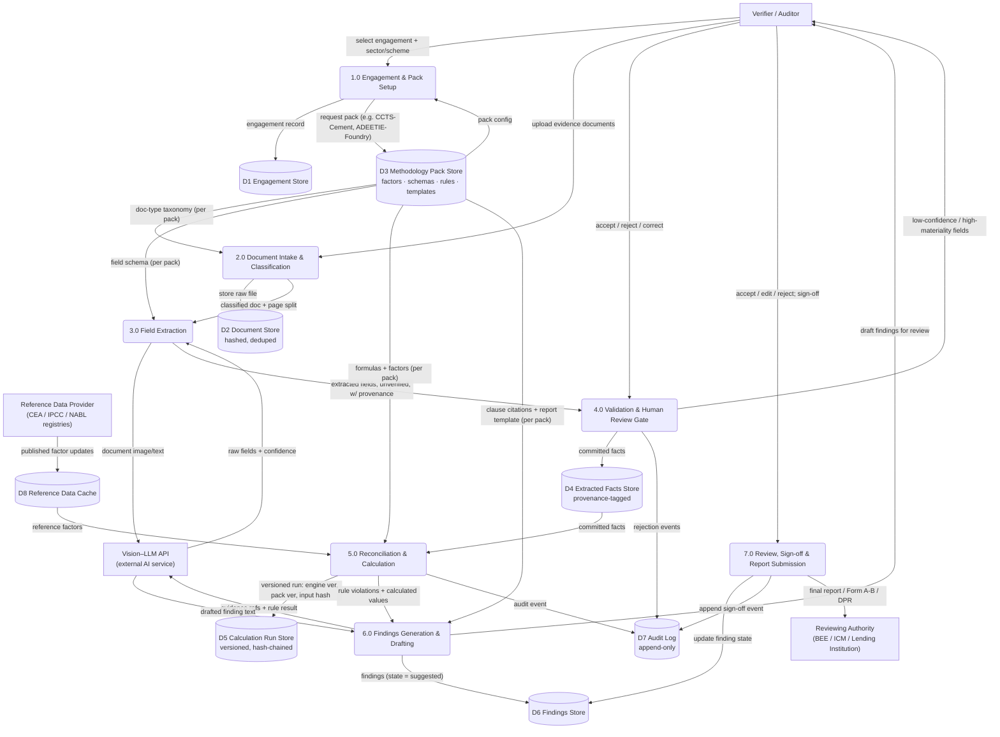
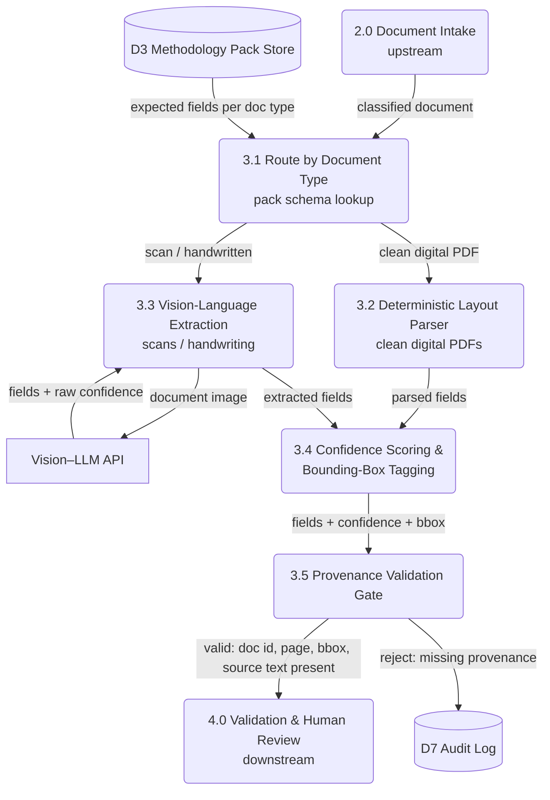
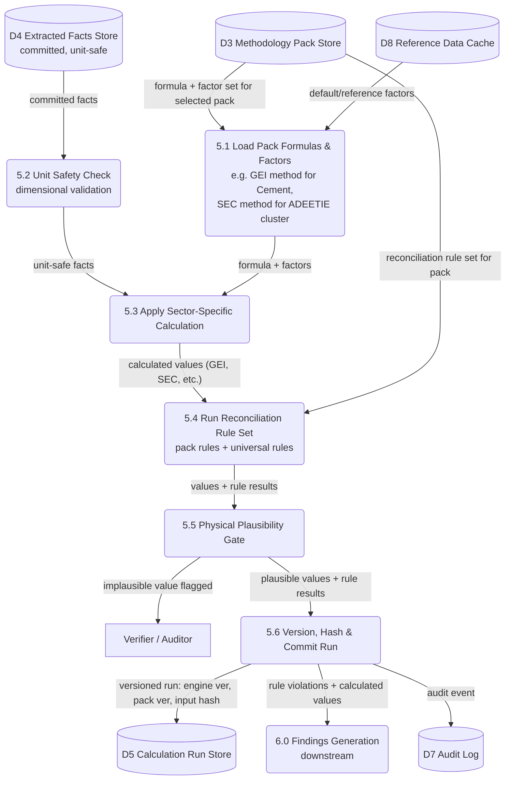

# VerifyStack — Low-Level Data Flow Diagrams (Level 1 & 2)

Paste any code block below into draw.io via **Extras → Edit Diagram**, or use the Mermaid import plugin. Each is a separate diagram — import them one at a time as separate pages/tabs, don't merge them.

## Notation used

- **Rectangle** `["..."]` — External Entity (something outside the system: a person or an outside system)
- **Rounded rectangle** `("N.N ...")` — Process, numbered per standard DFD leveling
- **Cylinder** `[("...")]` — Data Store

The whole point of this design: **Process 5.0 (Reconciliation & Calculation) and Process 3.0 (Extraction) never contain sector-specific logic.** All 9 CCTS sectors (Aluminium, Cement, Chlor-Alkali, Pulp & Paper, Iron & Steel, Fertilizer, Petrochemicals, Petroleum Refining, Textiles) and every ADEETIE cluster are handled by loading a different **Methodology Pack (D3)** — a data record, not new code. Adding a 10th sector later means adding a pack, not touching these diagrams.

---

## Level 1 DFD — whole system



---

## Level 2 DFD — decomposition of Process 3.0 (Field Extraction)



---

## Level 2 DFD — decomposition of Process 5.0 (Reconciliation & Calculation)



---

## How this covers all 9 CCTS sectors and every ADEETIE cluster without new processes

Each pack in D3 is a record shaped like this (illustrative, not final schema):

```
{
  pack_id: "CCTS-CEMENT-v1" | "ADEETIE-FOUNDRY-v1" | ...,
  scheme: "CCTS" | "ADEETIE",
  sector_or_cluster: "Cement" | "Foundry" | ...,
  document_taxonomy: [...],       // used by 3.1
  field_schemas: {...},           // used by 3.1 / 3.4
  calculation_method: "GEI" | "SEC" | ...,   // used by 5.1 / 5.3
  emission_or_energy_factors: {...},          // used by 5.1
  reconciliation_rules: [...],    // used by 5.4
  clause_citations: [...],        // used by 6.0
  report_template: "..."          // used by 6.0 / 7.0
}
```

Onboarding sector #10 (or ADEETIE cluster #4) means writing one new pack record — not touching Processes 1.0–7.0. This is the same "config, not code" principle used by mature audit-tooling platforms (CaseWare, Fieldguide) that support many audit frameworks on one engine.
